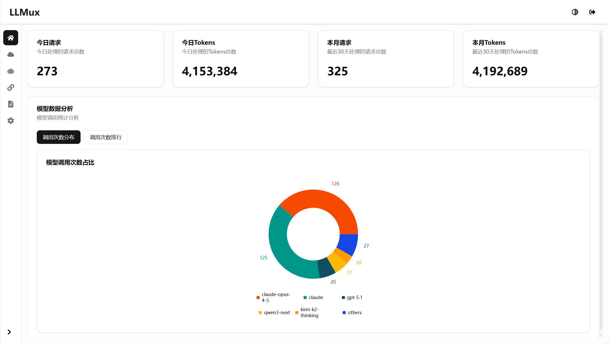
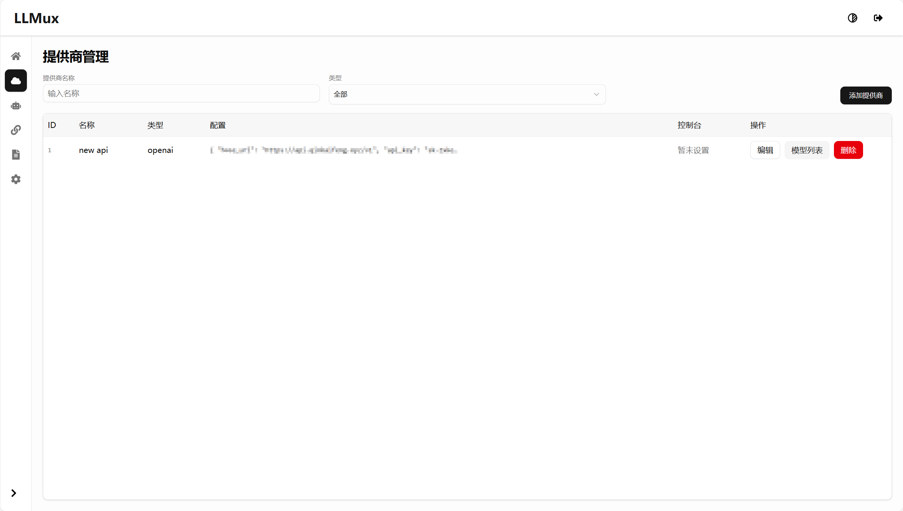
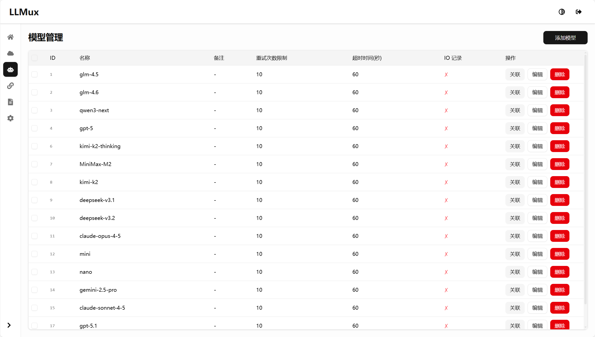
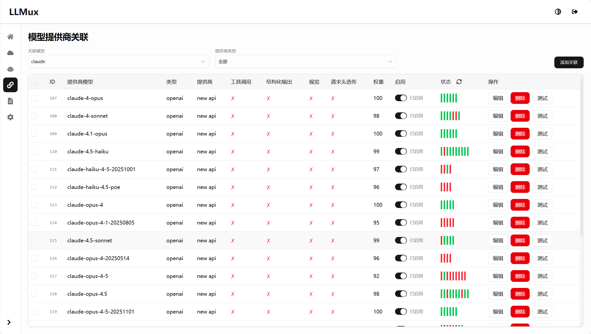
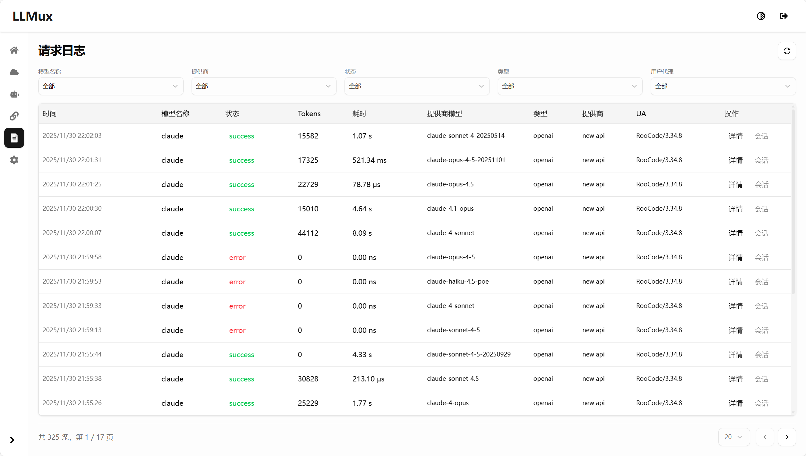
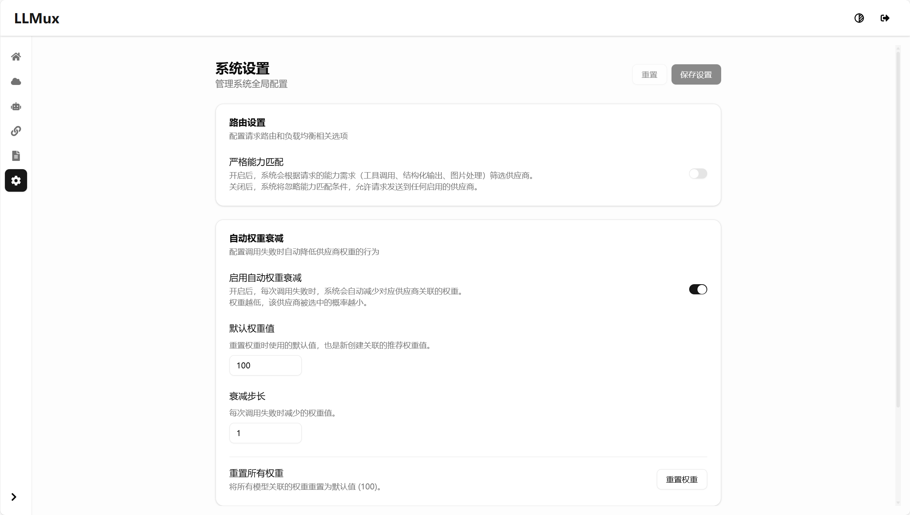

# LLMux

> 本项目基于 [atopos31/llmio](https://github.com/atopos31/llmio) 进行二次开发

一个多供应商 LLM API 代理服务，支持 OpenAI 和 Anthropic 格式的 API 调用，提供负载均衡、权重分配和统一管理界面。

## 功能特性

- 🔄 **多供应商支持** - 支持 OpenAI、Anthropic 等多个 LLM 供应商
- ⚖️ **智能负载均衡** - 基于权重的请求分发策略
- 📊 **实时监控** - 请求统计、使用量分析和日志记录
- 🎛️ **管理界面** - 现代化的 Web 管理后台
- 🔐 **安全认证** - Token 认证和访问控制
- 🐳 **容器化部署** - 支持 Docker 和 Docker Compose

## 技术栈

### 后端
- **Go 1.25** - 高性能 HTTP 服务
- **Gin** - Web 框架
- **GORM** - ORM 框架
- **SQLite** - 轻量级数据库

### 前端
- **React 19** - 用户界面框架
- **TypeScript** - 类型安全
- **Tailwind CSS** - 样式框架
- **Vite** - 构建工具

## 快速开始

### 环境要求

- Go 1.25+
- Node.js 20+
- pnpm

### 本地开发

1. **克隆项目**
```bash
git clone https://github.com/your-username/llmux.git
cd llmux
```

2. **启动后端服务**
```bash
# 设置环境变量
export TOKEN=your-auth-token

# 启动服务
make run
# 或者
go run main.go
```

3. **启动前端开发服务**
```bash
cd webui
pnpm install
pnpm run dev
```

4. **访问应用**
- API 服务: http://localhost:7070
- 管理界面: http://localhost:5173 (开发模式)

### Docker 部署

1. **使用 Docker Compose**
```bash
services:
  llmio:
    image: qkf688/llmux:latest
    ports:
      - 7070:7070
    volumes:
      - ./db:/app/db
    environment:
      - GIN_MODE=release
      - TOKEN=<YOUR_TOKEN>
      - TZ=Asia/Shanghai

```

```bash
docker-compose up -d
```

1. **访问应用**
- 服务地址: http://localhost:7070
- 管理界面: http://localhost:7070

## 项目结构

```
├── main.go                 # 应用入口
├── handler/               # HTTP 处理器
├── service/               # 业务逻辑层
├── middleware/            # 中间件
├── providers/             # LLM 供应商适配
├── models/                # 数据模型
├── common/                # 通用工具
├── balancer/              # 负载均衡器
├── webui/                 # 前端代码
│   ├── src/
│   │   ├── routes/        # 页面路由
│   │   ├── components/    # UI 组件
│   │   └── lib/          # 工具库
│   └── dist/             # 构建产物
├── db/                    # 数据库文件
└── docs/                  # 文档资源
```

## API 接口

### OpenAI 兼容接口
- `GET /v1/models` - 获取模型列表
- `POST /v1/chat/completions` - 聊天补全

### Anthropic 兼容接口
- `POST /v1/messages` - 消息处理

### 管理 API
- `GET /api/providers` - 供应商管理
- `GET /api/models` - 模型管理
- `GET /api/logs` - 日志查询
- `GET /api/metrics/*` - 统计数据

## 配置说明

### 环境变量

| 变量名 | 说明 | 默认值 |
|--------|------|--------|
| `TOKEN` | API 认证令牌 | - |
| `PORT` | 服务端口 | 7070 |

### 供应商配置

通过管理界面或 API 添加供应商配置：

```json
{
  "name": "OpenAI",
  "type": "openai",
  "api_key": "sk-xxx",
  "base_url": "https://api.openai.com/v1",
  "weight": 100
}
```

## 截图展示

### 主界面
<!-- 在此处放置主界面截图 -->


### 供应商管理
<!-- 在此处放置供应商管理页面截图 -->


### 模型配置
<!-- 在此处放置模型配置页面截图 -->


### 模型关联
<!-- 在此处放置模型关联页面截图 -->


### 日志监控
<!-- 在此处放置日志监控页面截图 -->


### 设置
<!-- 在此处放置设置页面截图 -->


## 开发指南

### 代码规范

- Go 代码使用 `go fmt` 格式化
- 前端代码使用 ESLint + TypeScript 规范
- 提交信息遵循 Conventional Commits

### 测试

```bash
# 后端测试
go test ./...

# 前端测试
cd webui
pnpm run lint
pnpm run build
```

### 构建

```bash
# 构建前端
cd webui
pnpm run build

# 构建后端
go build -o llmux .
```

## 部署

### Docker 部署

```bash
# 构建镜像
docker build -t llmux .

# 运行容器
docker run -d \
  -p 7070:7070 \
  -e TOKEN=your-token \
  -v ./data:/app/db \
  llmux
```

### 生产环境

1. 设置反向代理 (Nginx/Caddy)
2. 配置 HTTPS 证书
3. 设置环境变量
4. 配置日志轮转
5. 设置监控告警

## 许可证

本项目采用 MIT 许可证 - 查看 [LICENSE](LICENSE) 文件了解详情。

## 贡献

欢迎提交 Issue 和 Pull Request！

## 致谢

- 原项目: [atopos31/llmio](https://github.com/atopos31/llmio)
- 感谢所有贡献者的支持 
