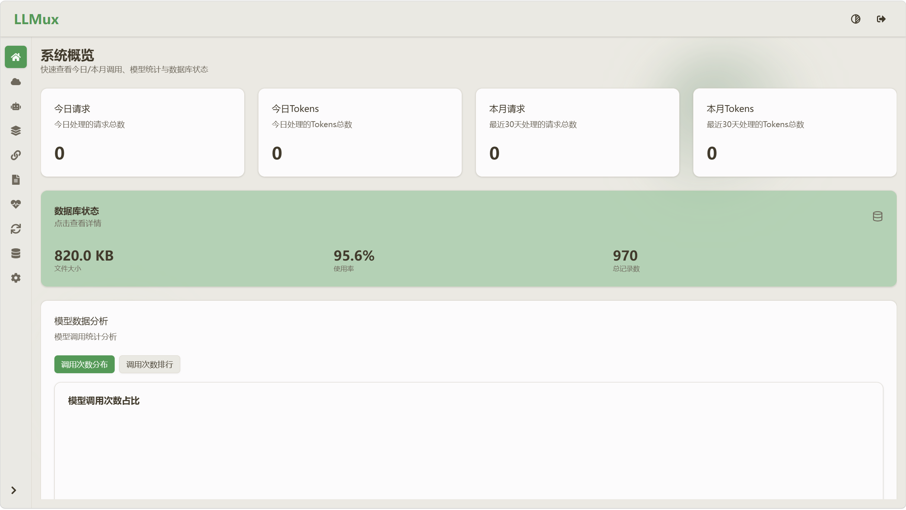
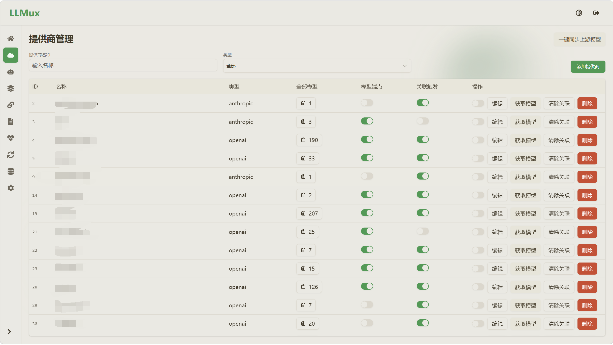
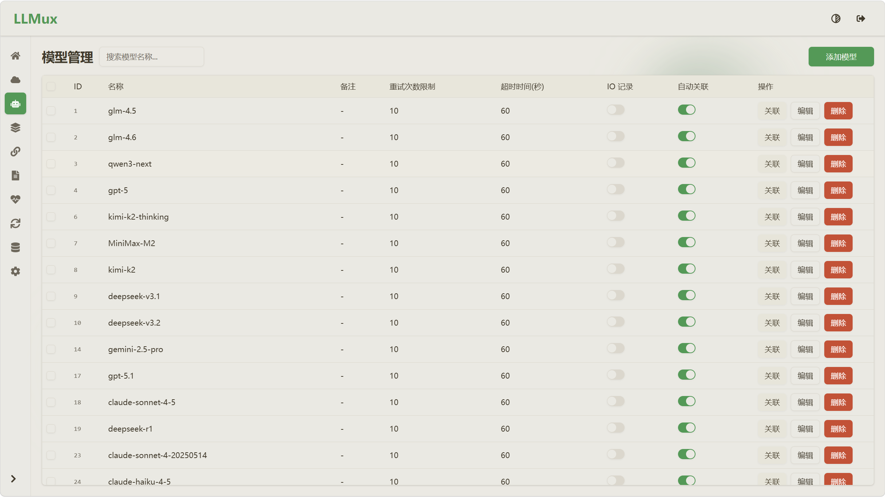
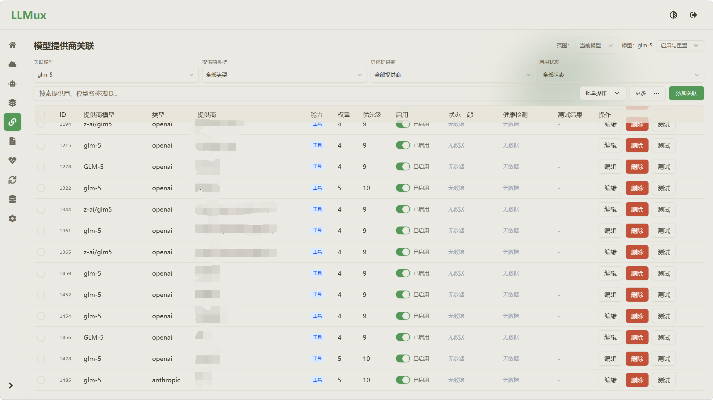
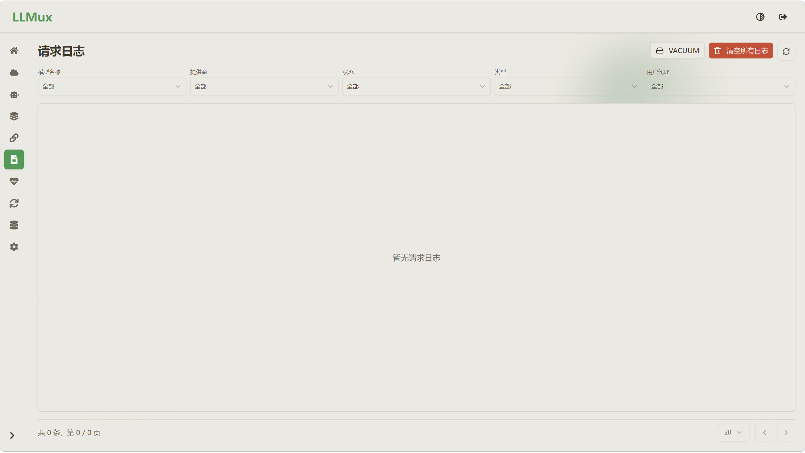
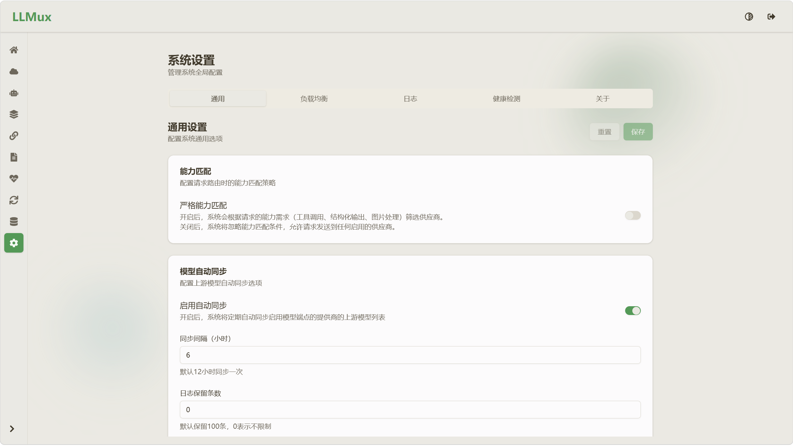

# LLMux 🚀

> 本项目基于 [atopos31/llmio](https://github.com/atopos31/llmio) 进行二次开发。

LLMux 是一个多供应商 LLM API 网关/代理：对外提供 **OpenAI / Anthropic 兼容**的 `/v1/*` 接口；对内提供一个 Web 管理后台，用于配置供应商、模型关联、虚拟模型、健康检查、模型同步，以及查看日志/指标。

## 适用场景 🎯

- 管理多个供应商，比如你有很多公益站。
- 个人使用的中转服务（不要生产环境使用，建议再套一层中转服务，如newapi，octopus）

## 功能优势

- **多供应商接入与统一出口** 🔌：openai chat competions/openai responses/anthropic之间相互转换。
- **负载均衡** ：有多个供应商渠道，但是质量不一？开启自动优先级功能，调用失败时自动减少优先级，保证优先使用质量好的模型
- **真实模型关联** 🔗：可将多个模型统一为一个真实模型，解决了当多个供应商的相同模型，但是每个供应商有不同的名字的问题，例如将z-ai/glm5、GLM-5、ZhipuAI/GLM-5统一为glm-5。
- **自动/一键关联** 🤖：自动关联，当你添加了一个新供应商时，自动关联模型，比如你新增的提供商有模型ZhipuAI/GLM-5，则会自动关联到统一模型glm-5下。
- **虚拟模型）** 🌀：将多个真实模型聚合为一个虚拟模型，当你有kimi-k2.5,glm-5,minimax-m2.5,qwen-3.5-plus的时候不知道用哪个？可以统一对外为一个模型code,轮询使用。
- **模型同步** 🔄：从供应商自动同步模型列表，自动同步时，支持过滤模型，例如可仅仅同步带:free后缀的模型,适配openrouter免费号只能使用:free后缀模型。

## Docker Compose 部署 🐳

`docker-compose.yml` 已包含示例配置（注意替换 `TOKEN` / `TZ`）：

```bash
docker compose up -d
```

```
services:
  llmux:
    image: qkf688/llmux:latest
    ports:
      - 7070:7070
    volumes:
      - ./db:/app/db
    environment:
      - GIN_MODE=release
      - TOKEN=<YOUR_TOKEN>
      - TZ=Asia/Shanghai

```


## 快速开始（本地）🚀

### 环境要求 📋

- Go 1.25+
- Node.js 20+（仅在需要构建 WebUI 时）
- pnpm（仅在需要构建 WebUI 时）

### 1) 构建 WebUI（首次必做；用于 Go `embed`）

```bash
make webui
# 或者
cd webui && pnpm install && pnpm run build
```

### 2) 启动服务

```bash
# 可选：不设置 TOKEN 则不启用鉴权（仅建议本地）
export TOKEN=your-auth-token
make run
```

PowerShell（Windows）：

```powershell
$env:TOKEN="your-auth-token"
go run .
# 或者（会先构建 webui，再启动服务，并尝试释放 7070 端口）
.\run.bat
```

### 3) 访问 🌐

- API：`http://localhost:7070`
- 管理界面（生产/内置页面）：`http://localhost:7070`
- 管理界面（开发模式）：`http://localhost:5173`（见 `webui/vite.config.ts`，会把 `/api` 代理到 `http://localhost:7070`）

## API（对外）🌍

### OpenAI 兼容

- `GET /v1/models`
- `POST /v1/chat/completions`
- `POST /v1/responses`

### Anthropic 兼容

- `POST /v1/messages`

## 截图 📷









## 许可证 📄

MIT License，见 [LICENSE](LICENSE)。

## 致谢 🙏

- 原项目：[atopos31/llmio](https://github.com/atopos31/llmio)
- 前端风格参考：[bestruirui/octopus](https://github.com/bestruirui/octopus)
